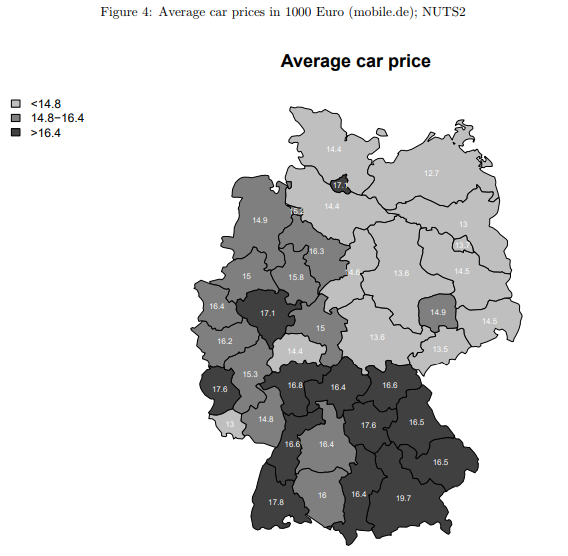
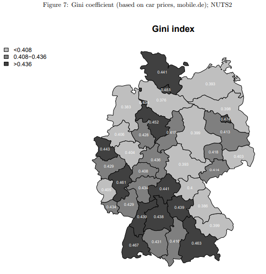
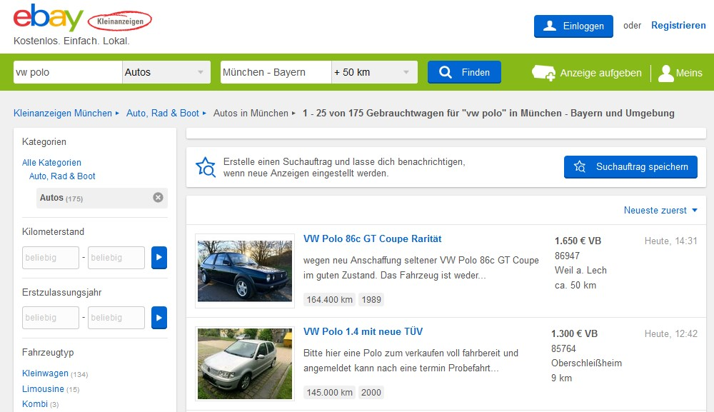
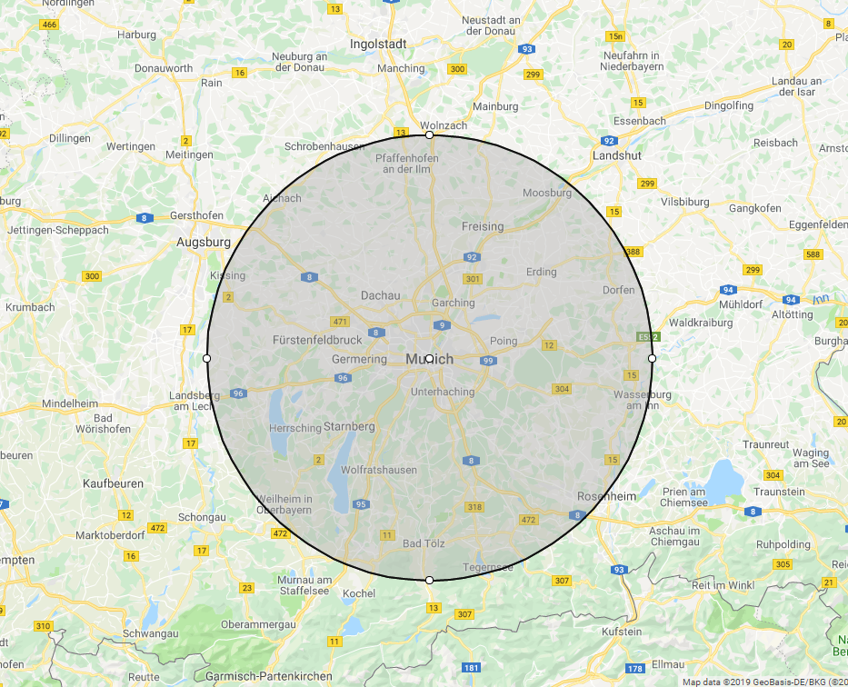

```{r setup, include=FALSE}
# note to students: you can ignore the content of this code chunk
knitr::opts_chunk$set(echo = TRUE, warning = FALSE, message = FALSE,
                      tidy = FALSE)
def.chunk.hook  <- knitr::knit_hooks$get("chunk")
knitr::knit_hooks$set(chunk = function(x, options) {
  x <- def.chunk.hook(x, options)
  ifelse(options$size != "normalsize", paste0("\\", 
                          options$size,"\n\n", x, "\n\n \\normalsize"), x)
})
hook_output <- knitr::knit_hooks$get('output')
knitr::knit_hooks$set(output = function(x, options) {
  if (!is.null(n <- options$linewidth)) {
    x = knitr:::split_lines(x)
    if (any(nchar(x) > n)) x = strwrap(x, width = n)
    x = paste(x, collapse = '\n')
  }
  hook_output(x, options)
})
```

```{r, include=FALSE}
knitr::opts_chunk$set(include = FALSE)
setwd("P:/07_Current Projects/SICSS/Group Project Week II/Github/cars-inequality/presentation")
```


## Inspiration

Kholodilin, K. & Siliverstovs, B. (2012) Measuring Regional Inequality by Internet Car Price Advertisements: Evidence for Germany.

```{r, out.width='80%', out.height='80%', echo = FALSE, fig.align = 'center'}


```

## Inspiration

Kholodilin, K. & Siliverstovs, B. (2012) Measuring Regional Inequality by Internet Car Price Advertisements: Evidence for Germany.

```{r, out.width='80%', out.height='80%', echo = FALSE, fig.align = 'center'}


```


## Question and Hypotheses

### Research Question

Do economic disparities between German cities/regions influence the prices of used cars?

### Hypothesis 1: 
The higher a city's GDP per capita, the higher is the expected price of used automobiles.

### Hypothesis 2: 
??????????Used car prices in rural areas are lower than in urban regions.

```{r eval=FALSE, include=FALSE}
## This chunk will not run or be published

```


## Data

Scraped Ebay Kleinanzeigen for (specific) used car offerings.

```{r, out.width='100%', out.height='80%', echo = FALSE, fig.align = 'center'}


```


## Slide 3
### Subtitle 3.1.

Practical applications

Important for Policy makers?
```{r echo=TRUE}
print("Hello World! Slide 3")

```


## Slide 4
### Circle Map

```{r, out.width='80%', out.height='80%', echo = FALSE, fig.align = 'center'}


```

## Inspiration for our Project

Insert graphic from the article that calculated GINI -> inspiration for our project idea
```{r, out.width='80%', out.height='80%', echo = FALSE, fig.align = 'center'}
knitr::include_graphics('insert_filename_here.PNG')

```


# test