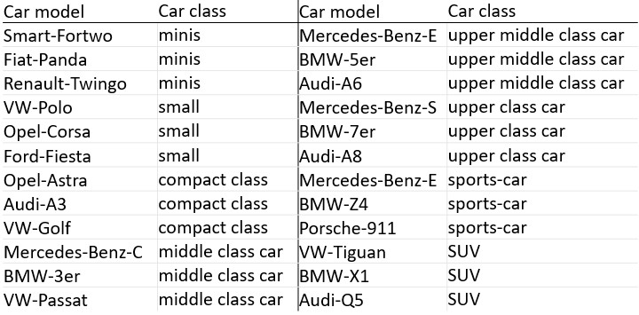
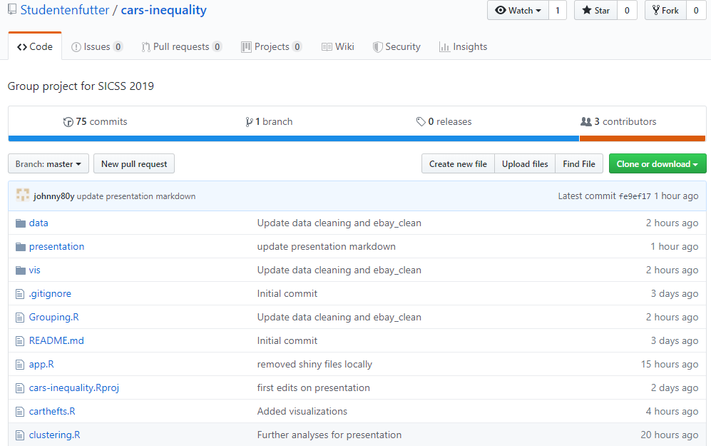
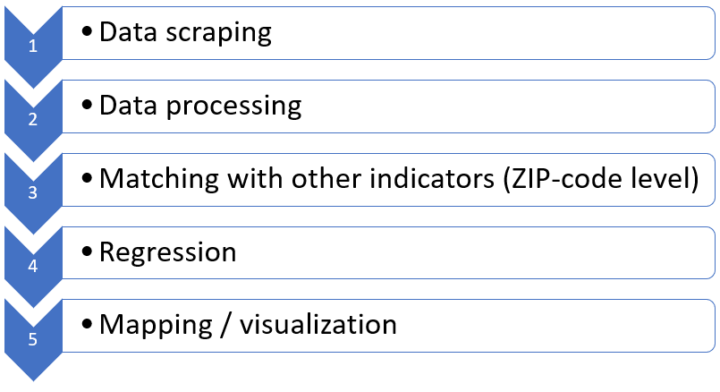
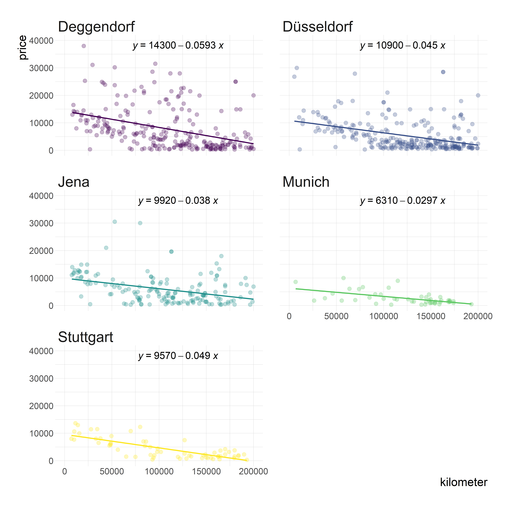
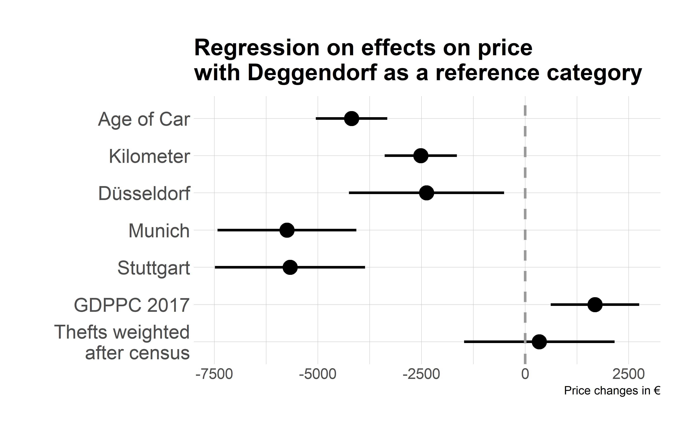
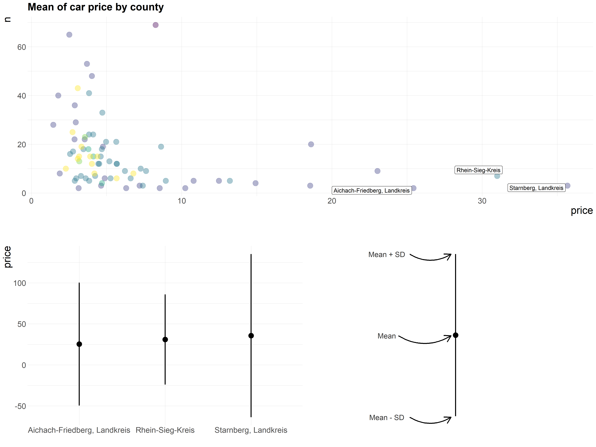
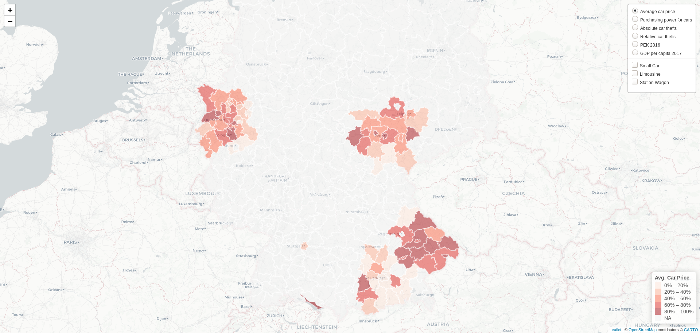

```{r setup, include=FALSE}
# note to students: you can ignore the content of this code chunk
knitr::opts_chunk$set(echo = TRUE, warning = FALSE, message = FALSE,
                      tidy = FALSE)
def.chunk.hook  <- knitr::knit_hooks$get("chunk")
knitr::knit_hooks$set(chunk = function(x, options) {
  x <- def.chunk.hook(x, options)
  ifelse(options$size != "normalsize", paste0("\\", 
                          options$size,"\n\n", x, "\n\n \\normalsize"), x)
})
hook_output <- knitr::knit_hooks$get('output')
knitr::knit_hooks$set(output = function(x, options) {
  if (!is.null(n <- options$linewidth)) {
    x = knitr:::split_lines(x)
    if (any(nchar(x) > n)) x = strwrap(x, width = n)
    x = paste(x, collapse = '\n')
  }
  hook_output(x, options)
})
```


## Inspiration

Kholodilin, K. & Siliverstovs, B. (2012) Measuring Regional Inequality by Internet Car Price Advertisements: Evidence for Germany.

```{r, out.width='60%', echo = FALSE, fig.align = 'center'}
knitr::include_graphics('gini_coeffs.PNG')

```


## Question and Hypotheses

### Research Question

Do economic disparities between German cities/regions influence the prices of used cars?

### Hypothesis: 
The higher a city's GDP per capita, the higher is the expected price of used automobiles.


## Data Scraping

```{r, out.width='100%', echo = FALSE, fig.align = 'center'}
knitr::include_graphics('ebay_screenshot.jpg')

```


## Sample

Five cities (+50km): Munich, Jena, Düsseldorf, Stuttgart, and Deggendorf

```{r, out.width='80%',  echo = FALSE, fig.align = 'center'}
knitr::include_graphics('map_circle.PNG')

```

## Sample

24 representative car models (top registrations per class in 2010)

```{r, out.width='100%', echo = FALSE, fig.align = 'center'}


```
(source: Kraftfahrtbundesamt)

## Data

###Scraped variables:
- Model & class
- Price
- Description
- Location
- Age & mileage

###Merged with macroeconomic indicators:
- GDP per capita
- Household income per capita
- Car thefts per capita


## Workflow

```{r, out.width='100%', echo = FALSE, fig.align = 'center'}


```


## Workflow

```{r, out.width='100%', echo = FALSE, fig.align = 'center'}


```


## Analysis

```{r, out.width='80%', echo = FALSE, fig.align = 'center'}


```


## Analysis

OLS:   (price ~ cities + mileage + age + gdp_pc)

```{r, out.width='100%', echo = FALSE, fig.align = 'center'}


```


## Analysis

```{r, out.width='100%', echo = FALSE, fig.align = 'center'}


```


## Map Visualization

```{r, out.width='100%', echo = FALSE, fig.align = 'center'}


```

https://cloud.sowi.uni-due.de/index.php/s/37LjkxP7DCe4j36


## Next Steps

- Extend data collection (more cities, car models, other products)
- Access APIs of other platforms
- Include additional control variables (condition, configurations, etc.)


## Application

- Tool for policy advisors
- Potential robustness test for consumer index measures (purchasing power)
- Tool for prospective car sellers/buyers


## Sources:

- Kholodilin, K. A., & Siliverstovs, B. (2012) Measuring regional inequality by internet car price advertisements: Evidence for Germany. Economics Letters, 116(3), 414-417. www-sre.wu.ac.at/ersa/ersaconfs/ersa12/e120821aFinal00913.pdf. 
- eBay Kleinanzeigen (2019) www.ebay-kleinanzeigen.de/.
- Statistische Ämter des Bundes und der Ämter (2019) Volkswirtschaftliche Gesamtrechnungen der Länder VGRdL. www.statistik-bw.de/VGRdL/tbls/?rev=RV2014&lang=de-DE#RV2014KR. 
- Kraftfahrtbundesamt (2011) Neuzulassungen von Personenkraftwagen nach Segmenten und Modellreihen im Dezember 2010 
https://web.archive.org/web/20140531110101/http://www.kba.de/DE/Presse/Presseportal/N_Segmente_Modellreihen_FZ11/N_Segmente2010/n_seg_12_10_pdf.pdf?__blob=publicationFile&v=4.


## Sources:

- GADM (2018) Country Spatial Data (version 3.6). https://gadm.org/download_country_v3.html.
- SERP Perception (2009) Umkreissuche PLZ/Ort. www.serp-perception.com/umkreissuche.php.
- Bundeskriminalamt (2018) PKS 2018 - BKA (Länder-, Kreis- und Städte) Übersicht Falltabellen, Grundtabelle - Kreise - ausgewählte Straftaten/-gruppen.
www.bka.de/DE/AktuelleInformationen/StatistikenLagebilder/PolizeilicheKriminalstatistik/PKS2018/BKATabellen/bkaTabellenLaenderKreiseStaedteFaelle.html?nn=108686.


## Reproduceability

https://github.com/Studentenfutter/cars-inequality


